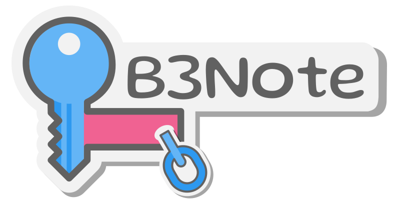

# B3Note: Revolutionizing Note-Sharing through Witness-Like Encryption on the Internet Computer



## Overview

Welcome to B3Note, an innovative decentralized application built on the Internet Computer that sets a new standard for secure and anonymous note-sharing. B3Note not only allows users to write and share notes anonymously without any login but also employs a unique form of encryption similar to Witness Encryption. This adds an extra layer of security and functionality to the platform.


## Key Features

- **Anonymous Usage**: B3Note can be used anonymously, with no login required.
- **Limited Notes for Anonymous Users**: Create up to 5 notes, each with a 1-hour timeout. After this period, the notes are automatically deleted. Additionally, any generated share link will also expire after 1 hour.
- **Canister Global Timer**: A global timer is employed to clean up expired users and one-time keys, thereby enhancing system efficiency and security.
- **Secure Sharing with On-Chain Verification**: Notes can be securely shared through a simple link that carries the signature of your public key. This signature is verifiable on-chain and pairs with the note's unique ID to confirm access to the decryption key for that note.
- **Auto Deletion**: Notes are automatically deleted either after they have been read for the first time or if they remain unread for an hour.
- **Advanced Encryption**: B3Note uses a form of witness-like encryption to ensure that only authorized users with the correct credentials can access the notes.
- **Timelock Encryption**: Encrypted decryption keys, notes, and shared links come with a built-in expiry feature, aligning with the concept of Timelock Encryption for temporary secure access.

## Use Cases

### Open/Blue Skies with a Focus on Witness-Like Encryption

B3Note stands out for its encryption mechanism that resembles Witness Encryption, enabling secure multi-party computation, anonymous credentials, and intricate access control systems. This feature also allows us to verify anonymous users directly on-chain, a significant advancement in decentralized technologies.

### IBE (Identity-Based Encryption) with Generated Public Keys

B3Note uses IBE to enable secure note-sharing based on uniquely generated public keys, thereby eliminating the need for traditional identifiers like email addresses or usernames and removing the complexities of pre-shared keys.

### Timelock Encryption

In line with the concept of Timelock Encryption, B3Note ensures that notes created by anonymous users expire after 1 hour. Shared links for these notes are also available only for the same time frame.

## Additional Resources

- [B3Note Live Demo](https://4lidq-zqaaa-aaaap-abkbq-cai.icp0.io/)
- [B3Note GitHub Repository](https://github.com/B3Pay/b3-note)
- [B3Utils GitHub Repository](https://github.com/B3Pay/b3_utils)

## Feedback

Your feedback is invaluable as we continue to develop and enhance this project. Feel free to raise issues or submit pull requests.

## Technologies Used

- Rust
- Internet Computer
- BLS Pairing for Blockchain Verification
- VetKeys API
- Symmetric Key Encryption
- Custom Rust crate: `b3_utils`

## Setup and Installation

1. Clone the repository

   ```bash
   git clone https://github.com/B3Pay/b3-note.git
   ```

2. Navigate to the project directory
   ```bash
   cd B3Note
   ```
3. Install dependencies
   ```bash
   yarn dfx:start
   ```
4. Deploy it
   ```bash
   yarn deploy
   ```
5. For development mode:
   ```bash
   yarn dev
   ```

## Usage

### Anonymous Note Sharing:

1. Open the application go to the 'Without Identity
   ' tab
   and select 'Random Login'.
2. Write your note and click 'Save'.
3. Open the Note and click 'Generate Link'. Share this link to give read access to the note.
4. The link is valid for one hour and will be deleted after the first access.

### Authenticated Note Sharing:

1. Open the application and go to the 'With Identity' tab.
2. Login with your Internet Computer identity.
3. Write your note and click 'Save'.
4. Open the Note and click 'Generate Link'. Share this link to give read access to the note.

## Features

- **Anonymous Note Sharing**: Create and share notes without login.
- **Authenticated Note Sharing**: Enhanced security through blockchain verification.
- **Time-Limited Links**: Links expire after one hour or after the first access.
- **Blockchain Verification**: Utilizes BLS pairing for note verification.
- **Strong Encryption**: Notes are encrypted using symmetric key encryption and VetKeys API.
- **Utility Crate**: `b3_utils` makes it easy to use various Internet Computer features like stable memory, timers, and logging.

## License

This project is open-source, licensed under MIT.
